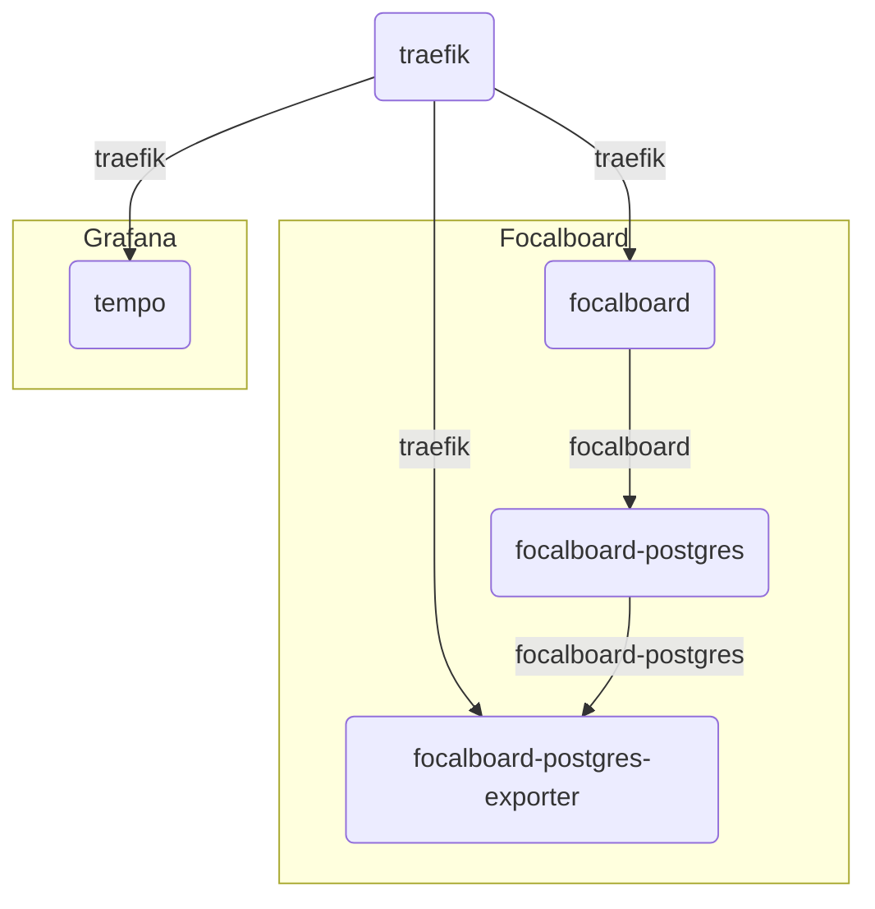

# Team server infrastructure


## Server [ansible](https://www.ansible.com) initialization

```shell
ansible-playbook -i playbook/inventory/all.yaml playbook/init.yaml
```

## Up local

```shell
docker network create traefik
docker compose --env-file .env.local up
```

## Deploy on server

### Set secrets

* `SSH_DEPLOY_PRIVATE_KEY` - e.g. `AAAwEAA ...`
* `BASIC_AUTH_USER` - e.g. `admin`
* `BASIC_AUTH_PASSWORD` - e.g. `admin`

### Run GitHub action manually

[Deploy action](https://github.com/treeton-org/team/actions/workflows/deploy.yml)

## Docker network scheme

