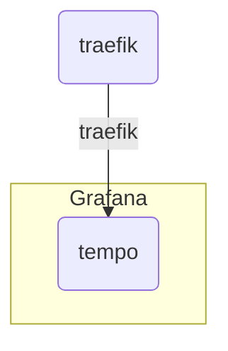

# Team server infrastructure


## Server [ansible](https://www.ansible.com) initialization

```shell
ansible-playbook -i playbook/inventory/all.yaml playbook/init.yaml
```

## Up local

```shell
docker network create traefik
docker compose --env-file .env.local up
```

## Docker network scheme

